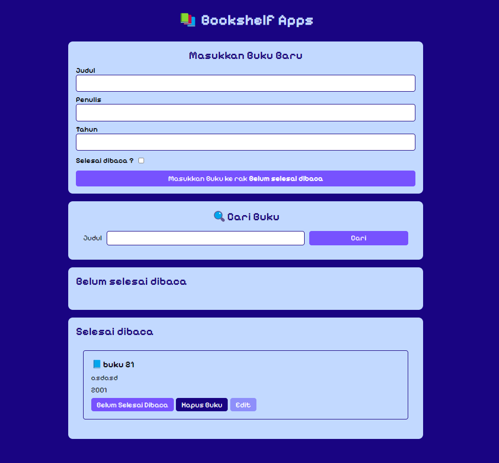

# Bookshelf Apps
Submission Dicoding Course - Belajar Membuat Front-End Web untuk Pemula

### Features

- Mampu Menambahkan Data Buku baru.
- Memiliki minimal Dua Rak Buku. Yakni “Belum selesai dibaca” dan “Selesai dibaca”.
- Dapat Memindahkan Buku antar Rak.
- Dapat Menghapus Data Buku.
- Dapat Memperbarui Data Buku.
- Memanfaatkan localStorage dalam Menyimpan Data Buku.

### Links

- [Live site URL](https://wayosu.github.io/bookshelf-apps/)
